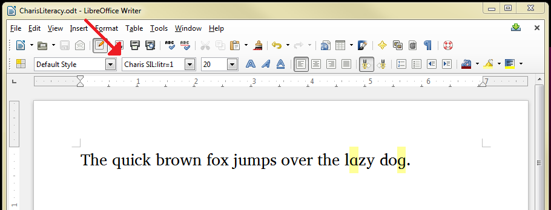
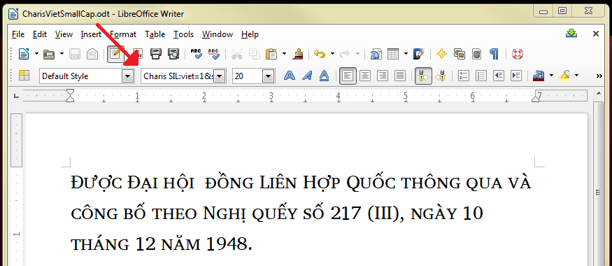
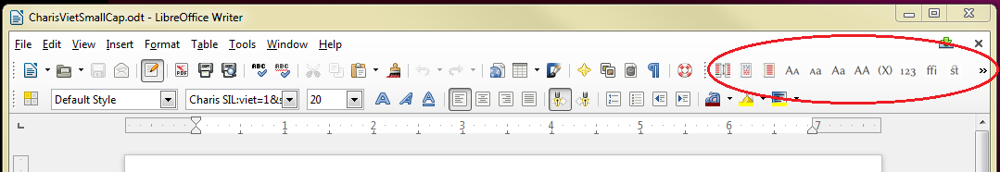

import CaptionText from '/src/components/CaptionText.astro';

Since version 3.4, [LibreOffice](http://www.libreoffice.org/) has supported SIL's smart-font technology called [Graphite](http://graphite.sil.org). When using Graphite, it is often important to be able to control user-definable features. An example of a user-definable feature would be the single-bowl forms of the a and g characters that are often used for literacy purposes, which are available in SIL's [Roman fonts](https://scripts.sil.org/SILUnicodeRF_Features) such as [Charis SIL](http://software.sil.org/charis/) and [Doulos SIL](http://software.sil.org/doulos/). Another example is [Annapurna](http://software.sil.org/annapurna/)'s two alternate forms of the :usv[091D]{usv char name} needed for Nepali (झ) and Newari (झ).

As I was working with this feature recently, I knew that it was possible to do this in LibreOffice's font control, but it was hard to find on-line documentation giving the details. I thought it might be helpful to write it up here so that the information is located in an obvious place.

My search did turn up some useful information, however: I discovered that there are two different ways to accomplish this (in theory anyway).

#### Extending the font name in the font control

The most straightforward approach involves typing the desired features directly into the font control. To do this you need to know the feature IDs and setting values defined in the font. These should be documented as part of the font package. The feature ID is a four-letter string and the setting value is an integer, very commonly 0 (off) or 1 (on).

For instance, to access the literacy feature in Charis SIL, append ":litr=1" to the name of the font in the control so that the font name reads: Charis SIL:litr=1. (Click on the image to get a full-sized display.)

You can specify multiple features by using an ampersand (&amp;) between the feature values. The text below uses "Charis SIL:viet=1&amp;smcp=1" to indicate both small caps and Vietnamese-style diacritic positioning (the order doesn't matter).

Unfortunately, the font control is not wide enough to easily see the full font specification when there are multiple features selected, so the mechanism is rather awkward. The Format &gt; Character dialog contains a control that is a little wider.

#### Tool bar extension

There is also a toolbar extension that you can install in LibreOffice that can be more convenient to use than typing magic codes into the font control. However, it will only work with a limited set of predefined features, and the Graphite font must be specifically programmed to use the expected identifiers.

To install the extension:

- Download the [Typography toolbar](http://extensions.libreoffice.org/extension-center/typography-toolbar).
- In LibreOffice, open the Tools &gt; Extension Manager dialog, click the Add... button, and choose the downloaded file.
- Click on the View &gt; Toolbars menu and activate the toolbar by making sure "Typography" is checked. The toolbar will appear as shown below. Notice the arrow to the right which will display a menu of many more features.

The Typography toolbar works with Charis's small caps feature, but no other features in that font. So while it is helpful when working with OpenType features, it is of limited usefulness with Graphite.

<CaptionText text='This article formerly appeared on ScriptSource.'/>