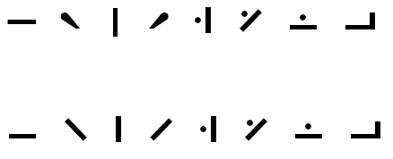

import CaptionText from '/src/components/CaptionText.astro';

Chinantec uses tone marks from the [Modifier Tone Letters](http://www.unicode.org/charts/PDF/UA700.pdf) block as well as from the [Spacing Modifier Letters](http://www.unicode.org/charts/PDF/U02B0.pdf) block. The characters pulled from the Spacing Modifier Letters block require glyph variants.

In the sample below, the first 4 characters are from the Spacing Modifier Letters block. The top row demonstrates what they look like in standard fonts. The second row demonstrates the variants as required by Chinantec.

The proposal for these characters can be found here: [Revised Proposal to Encode Chinantec Tone Marks](https://www.unicode.org/wg2/docs/n2883.pdf)

<CaptionText text='This article formerly appeared on ScriptSource.'/>