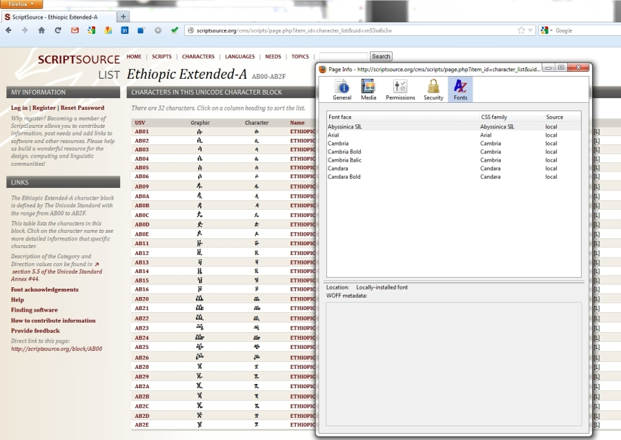
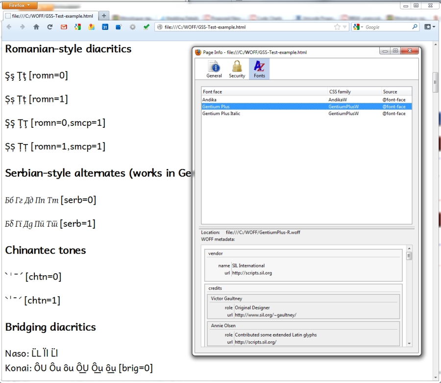

import CaptionText from '/src/components/CaptionText.astro';

This is an add-on that I think will be useful. I saw this on the [Unicode list](http://www.unicode.org/mail-arch/unicode-ml/y2012-m07/0150.html) a while back, and I am just now getting around to trying it. The add-on allows you to see which fonts are actually being used on a webpage. You can see if the font is on your local system or the web. If a WOFF font is being used you can see the metadata.

Here is the [download page](https://addons.mozilla.org/en-US/firefox/addon/font-infos/?utm_source=addons.mozilla.org).

To use _fontinfo_, right click on a page, select "View Page Info" and then click on "Fonts".

This screenshot shows a [ScriptSource page](https://scriptsource.org/block/AB00): 

This one shows a page on my computer using a WOFF font. The metadata for the font can be seen.

<CaptionText text='This article formerly appeared on ScriptSource.'/>