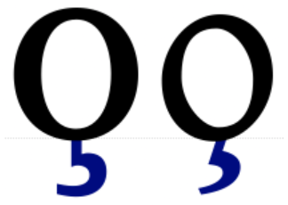

import CaptionText from '/src/components/CaptionText.astro';

What Unicode calls a 'cedilla' can take two different forms: a 'comma under' form (used for Latvian and combined with 'g', 'k', 'l', 'n' and sometimes 'r'), and a traditional, connected form used for French and other languages. The comma form is also acceptable for French in certain typestyles, but is not appropriate for some languages, such as Marshallese. For more information see this [short paper by Eric Muller](https://docs.google.com/viewer?url=http%3A%2F%2Fwww.unicode.org%2FL2%2FL2013%2F13037r-cedillas-and-commas-below.pdf).

For those languages that use the traditional form, another question can arise: where to attach it to the base letter - or even whether to attach it at all. By default, the position should be centered and attached to the base. However if there is no central stroke to attach to, as on the 'A', the answer is less clear, as it might be typographically more attractive to attach the cedilla elsewhere.

Even if the cedilla is centered, the precise placement may depend on the individual cedilla shape. If the attaching stroke is purely vertical, then aligning it with the base's optical center is normally good. However, if the attaching stroke is highly angled it is better to align the optical centers of the cedilla and base, which may mean that the actual attachment is slightly to the right of center.

Here is a summary of the letters that either should not have a centered cedilla, or for which some further explanation may be helpful. For some of these the preferred position is clear, but for others only a guess can be made. As far as I can tell, these seem to be the most commonly accepted and correct placements, but corrections are welcomed. We are currently in the process of revising all our fonts to implement these placements.

| Base | Position | Notes |
| ---- | -------- | ----- |
| A | center | Right leg is more typographically attractive, but an unattached central position seems to be preferred, at least in central Africa |
| a | center | Right leg is more typographically attractive, but an unattached central position seems to be preferred, at least in central Africa |
| C | center | Comma-style sometimes acceptable for French |
| c | center | Comma-style sometimes acceptable for French |
| f | stem center | Design suggestion |
| H | left leg | Most commonly agreed position |
| h | left leg | Most commonly agreed position |
| K | left leg | Design suggestion |
| k | left leg | Design suggestion |
| M | right leg | Marshallese, central position common in many fonts, comma-style not acceptable |
| m | right leg | Marshallese, central position common in many fonts, comma-style not acceptable |
| N | right leg | Marshallese, central position common in many fonts, comma-style not acceptable |
| n | right leg | Marshallese, central position common in many fonts, comma-style not acceptable |
| R | left leg | Design suggestion |
| r | stem center | Design suggestion |
| x | right leg | Design suggestion |

<CaptionText text='This article formerly appeared on ScriptSource.'/>