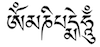
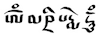

import CaptionText from '/src/components/CaptionText.astro';

The Tibetan script is written in two main styles. The _dbu can_ or _uchen_ variant, literally meaning 'with a head', is normally used in Tibetan printed material as well as for writing the Dzongkha language of Bhutan. This style is characterized by upright, block forms which hang from a heavy horizontal baseline, and tapering vertical lines. It is the most commonly-used form of the Tibetan script. Below is an example of the Buddhist mantra _om mani padme hum_ in _dbu can_ writing.

The _dbu med_ or _umê_ variant, literally meaning 'headless', is a more cursive form used for everyday shorthand texts. There are two main types of _dbu med_ writing; _bru-tsa_, which is used for writing secular documents, and _dpe-tshugs_, which is a more formal, calligraphic style used for writing scriptures. As indicated by the name, _dbu med_ writing does not contain the heavy horizontal baseline of _dbu can_.  Below is an example of the Buddhist mantra _om mani padme hum_ in _dbu med_ writing.

<CaptionText text='Reference: Dbu med image modified from [jayarava&#x2019;s photo](http://www.flickr.com/photos/jayarava/4250749342/) on flickr'/>

<CaptionText text='This article formerly appeared on ScriptSource.'/>