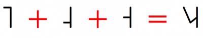

import CaptionText from '/src/components/CaptionText.astro';

Many people do not understand that the individual tone letters (Right-stem: U+02E5..U+02E9 or Left-stem: U+A712..U+A716) are used to turn into the tone glides. The tone glides do not need to be encoded in Unicode. Do not mix the Right-stem and Left-stem tone letters. 

It is important to have a smart font (like [Doulos SIL](http://software.sil.org/doulos/)) to make it work. You should type the tone letters in the correct linguistic order and they should become the correct tone glide. For example:

<CaptionText text='This article formerly appeared on ScriptSource.'/>