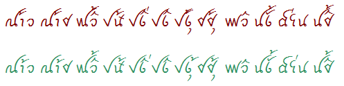
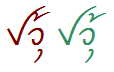
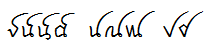

import CaptionText from '/src/components/CaptionText.astro';

One of my areas of responsibility has been writing Graphite code to handle smart font behaviors in Tai Heritage Pro, SIL's font for the Tai Viet script. A major challenge in this script is handling glyph collisions. Applying the "Vowel over final consonant" feature produces a specific style that is used by the Tai Dam community in Southeast Asia that, unfortunately, is difficult to render without glyph collisions. The following image shows some examples, where the red text contains the collisions and the green text has been fixed.



As I continued to tweak the rules to handle newly-discovered rendering problems, I was constantly asking, "Do I need to add a rule to handle this situation? Or is there already a rule to handle it, and it is just not working correctly? And if I change a rule, what else will that break?" As the set of GDL (Graphite Description Language) rules to handle collisions approached a dozen screenfuls, I found my productivity in adding and modifying rules sharply decreasing, and my frustration level rising! The rudimentary state of Graphite debugging tools was certainly a factor, but another problem was that the rules were something of a hodge-podge; I had tossed rules into the code file as I found a need for them with only a half-hearted attempt at keeping them organized. I knew I was going to have to come up with a system for more cleanly matching rules to their "use cases" if my code was going to be maintainable.

An additional motivational factor was the prospect of developing a font for nastaliq, a style of Arabic that's notorious for producing glyph collisions. My hope was that developing a system for Tai Heritage Pro would give me insight into an approach for nastaliq.

Vaguely inspired by the Dewey Decimal system, I decided to try an outline approach. Just as it is possible to fit any book topic into the Dewey Decimal "outline", my goal was to develop an outline that would reflect the various elements of any possible collision rule. Then every rule could be labelled with its relevant place(s) in the outline, making it easy to find and/or physically group rules that affect similar contexts.

For instance, consider a rule involving (1) an initial consonant with a long right tail, (2) a lower vowel mark, (3) a tone-2 mark (mai-tho), and (4) a narrow following consonant, where the purpose of the rule is to shift the mai-tho to avoid the tail of the initial consonant. Again, the red text below shows the collision between the initial consonant and the tone mark; the green text has been fixed.



If the outline looked something like:

<span class='Literal'>3. initial long-right-tail consonant</span> <br />
<span class='Literal'>...</span> <br />
<span class='Literal'>3.2. short-narrow-consonant</span> <br />
<span class='Literal'>3.2.1. lower-vowel-U</span> <br />
<span class='Literal'>...</span> <br />
<span class='Literal'>3.2.1.2. mai-tho</span> 

I could label the rule in my GDL code as follows:

```


// 3.2.1.2

cls_longRightTail<span> </span><span> </span>g_vowelU<span> </span><span> </span>g_maiTho {shift.x = 250m}<span> </span><span> </span>cls_shortNarrowCons;


```
But since the number of possible combinations is enormous, the trick, of course, is to develop an outline that is rich enough to handle all the real-life cases but not so huge as to be overwhelming. This presents something of a Catch-22: in order to know the real-life cases, you may need to write a fair number of rules, but the more rules you have, the harder it is to go back and impose a structure on them! Ideally you have done a good bit of analysis ahead of time and can can come up with a useful initial structure from the outset, but this was exactly what I had _not_ done.

A practical way to deal with the need to adjust the structure after you have already documented your rules would be to leave gaps in the outline--for instance, increment each section number by 5 or 10 so you can later insert. However, as I found numbering the outline by hand tedious, I was documenting the structure in LibreOffice, which does not handle that approach nicely (nor do I know of a program that does).

An advantage, though, of using LibreOffice, specifically for Graphite, was that it can use Graphite for rendering, so I was able to insert within each section examples of text that make use of the relevant rules--and see them rendering correctly (or not!). Since I always kept the outline file open while I worked, I also found it helpful to label sections with USVs and glyph shapes as a handy reference.

So my process was not ideal, and it did require me to go back and renumber some sections in my code after I had already labeled them.

As an overall approach, my outline was organized in the form of (1) initial consonant, (2) following vowel or consonant, (3) vowel mark, and (4) tone mark. This, of course, reflects the structure of the Tai Viet script, and could be significantly different for another script. I always included a section at the end called "Any/other" that would hold more general rules, for instance:

<span class='Literal'>3.1.1.3  Left-side-vowel</span> <br />
<span class='Literal'>3.1.1.3.1  Vowel-E = AAB5 </span>:usv[AAB5]{char} <br />
<span class='Literal'>3.1.1.3.2  Vowel-0 = AAB6 </span>:usv[AAB6]{char} <br />
<span class='Literal'>3.1.1.3.3  Vowel-UAE = AAB9 </span>:usv[AAB9]{char} <br />
<span class='Literal'>3.1.1.3.4  Vowel-AUE = AABB </span>:usv[AABB]{char} <br />
<span class='Literal'>3.1.1.3.5  Vowel-AY = AABC </span>:usv[AABC]{char} <br />
<span class='Literal'>3.1.1.3.6  Any/other left-side-vowel #9</span>

(In this case there are no other left-side vowels beside those enumerated, so the "Any/other" section would hold rules that apply to multiple vowels.) I used the convention of assigning a 9 to the "Any/other" section, regardless of the number of previous items.

But, as previously mentioned, a truly purist outline could potentially become unmanageably large. In Tai Viet, the majority of the collisions occur in the context of a long right tail interfering with a diacritic on the following letter. A smaller group involve a shorter right tail followed by a narrow character, where the diacritic on the narrow character needs to be shifted right. So I made categories for these cases right near the top of the outline.

Another practical factor involved how to label the rules in the code. I found that a group of about 5-7 rules was small enough that I could easily grasp the interactions between them, so I often would put a single section label on them. Beyond that, it became smart to split them into smaller sections.

I also tried to be as consistent in the section numbering as possible. For instance, many sections would have subsections involving the two tone marks, mai-ek (:usv[25CC]{char}&nbsp;:usv[ AABF]{char}, tone 1) and mai-tho (:usv[25CC]{char}&nbsp;:usv[ AAC1]{char}, tone 2). I decided to always use 1 for mai-ek and 2 for mai-tho. Similarly, I created 5 subsections for the five vowel diacritics (plus a sixth section for "Any/other"), even though some of these combinations never required a collision rule.

The process confirmed font design principles that I was already aware of. Keeping the design of similar glyphs as similar as possible is an immense help in keeping the collision avoidance problem manageable. For instance, you can see how the identical tails of these groups of characters allow a single rule to handle the entire group consistently.



Fortunately, our font designer had previously reworked a number of shapes for this very reason.

#### Summary

One of the advantages of this exercise was that it forced me to review and understand all the code in my program, some of which had been written several years before! Now that everything is labeled and documented, I'm much more confident that I can come back to the code in, say, the year 2015 and quickly remember the purpose of each rule and relationship between them. While the outline didn't remove the need or the tedium of using Graphite's debugger logs to figure which rules were being fired, it made me much more confident that any changes would have the desired effects--and only those effects! (And by the way, work is underway to develop a much more friendly debugger and development tool for Graphite.)

I also have a much better feel for the kind of analysis that will need to be done to handle nastaliq-styled Arabic.

While the approach I used was applied to Graphite, in theory it could also be applied to OpenType rules. The problem would be the lack of a good commenting mechanism in VOLT, making it difficult to label the rules. However, possibly the lookup names could reflect the outline system.

If you have any suggestions for how I could improve my analysis or processes, please respond!

<CaptionText text='This article formerly appeared on ScriptSource.'/>