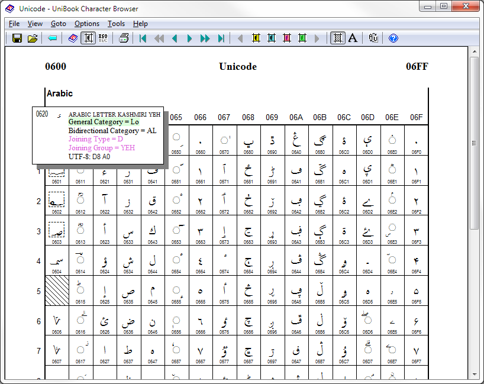

import CaptionText from '/src/components/CaptionText.astro';

For the casually interested, browsing among the thousands of characters available in the Unicode standard can be a fascinating experience. For those implementing writing system components, finding exact details about a particular character or set of characters can be essential to a successful design. 

Fortunately there are a variety of tools available for browsing the Unicode characters and their properties, and this article discusses a number of them, including:

- [ScriptSource website](#ScriptSource)
- [Unicode website](#UnicodeWebsite)
- [Unibook character browser application](#Unibook)
- [gucharmap — the gnome charmap application](#gucharmap)
- [UniView website](#UniView)
- [FileFormat.Info website](#FileFormat.Info)


<a name='ScriptSource'></a>
### ScriptSource

Of course ScriptSource itself can be used to find some details of specific characters. See the [Unicode Status in ScriptSource](https://scriptsource.org/entry/tn9r6q9euj) entry for tips on how to search for characters by their Unicode character value (USV), and what kind of Unicode information ScriptSource provides for each character.

One handy trick for ScriptSource is that character detail pages include the USV directly in the URL, e.g:

```
https://scriptsource.org/cms/scripts/page.php?item_id=character_detail&amp;key=U000628
```
thus it is possible to define a quick-search in your browser to allow you to go directly to any character detail page of interest.

<a name='UnicodeWebsite'></a>
### Unicode website

The starting place — the horse's mouth as it were — for all Unicode character information is the [Unicode website](http://www.unicode.org) itself. There you can browse the [latest version](http://www.unicode.org/versions/latest/) of the standard as well as many of the archived previous versions. The text chapters of the standard and the [charts](http://www.unicode.org/charts/) are generally provided as PDFs, while other textual items such as the annexes and technical reports are provided as html pages. Most of the details about a particular character, however, are encoded in data files known as the [Unicode Character Database](http://www.unicode.org/ucd/) or _UCD_. 

Don't be frightened off by the term _database_ — all the files in the UCD are _human readable_ text files so you can open them directly in your favorite plain text editor. Even so, there are over 60 separate files in the UCD (or, if you prefer XML, the same information is contained in a handful of structured XML files), so finding your way around in this forest can be difficult. And the primary UCD file contains over 24,000 lines of text — and that is not counting the 300,000 lines describing unified Han characters that are elsewhere in the UCD. Whew!

This is where Unicode character browsers help out: they provide easy ways to find and study the characters that interest you.

<a name='Unibook'></a>
### Unibook

The Unicode Consortium itself provides a useful character browser called [Unibook](http://www.unicode.org/unibook). The original (and continuing) purpose of this program was to print the code charts used to publish the Unicode standard, but it has evolved into a general purpose and useful Unicode character browser. In the Unibook browser window you can click on any character cell and a popup will give additional details (user configurable) about that character. You can also copy any character to the clipboard, thereby providing character-picker functionality.

Unibook's sophisticated search facilities can find and highlight characters based on up to four criteria including Unicode property values, character names, font coverage, and even user-supplied property files. Other advanced capabilities include Bidi and Line Break algorithm demos, legacy character set views, and flexible font selections.

One of Unibook's main strengths is that it runs locally and does not require an internet connection. Unfortunately it has two weaknesses: it is Windows only, and can display glyphs only for those characters for which you have fonts installed on your system. Nonetheless it has been a mainstay of Unicode developers for years.


<a name='gucharmap'></a>
### gucharmap — the gnome Unicode charmap

Like Unibook, [gucharmap](https://wiki.gnome.org/Apps/Gucharmap) is an application that runs locally. Built on gnome and gtk+, gucharmap could theoretically run on any platform but is most commonly available on Linux-based systems such as Ubuntu (screenshot at left). It provides a simple interface that shows some of the Unicode character properties of the selected character, and it can be used as a character picker. Also like Unibook, it requires fonts to be installed in your system.


<a name='UniView'></a>
### UniView

On his website, Richard Ishida has published a number of useful Unicode-related tools and resources. Relevant to this topic, Richard's [UniView](http://r12a.github.io/uniview/) page is a very capable and useful character browser. Displayed at left is again the Arabic block with one particular character having been selected.

By default UniView displays server-generated graphics for each character, meaning you don't have to have the fonts on your local machine. There is an option to display characters as text rather than graphics, in which case you would need to configure the desired fonts into your browser settings.

In addition to browsing the Unicode character database, UniView can serve as a character picker and as a clipboard viewer, allowing one to see exactly what Unicode characters are in the clipboard text.


<a name='FileFormat.Info'></a>
### FileFormat.Info

One of the links on UniView leads us to another useful Unicode resource at [FileFormat.Info](http://www.fileformat.info/info/unicode/). At left is the information FileFormat.Info displays for a single Arabic character. One of the strengths of this site is that it shows how the character would be expressed in various Unicode Encoding Forms and programming languages. Another useful aspect of this site is that you can put the character you want directly in the URL for example:

```
http://www.fileformat.info/info/unicode/char/067b/index.htm
```
Thus you could set up quick-searches in your browser to go directly to the character.


---


Each tool has strengths and weaknesses, so you may not find one tool that does all you need. 

If you know of other useful Unicode character browsers, let me know via the Comments below.

<CaptionText text='This article formerly appeared on ScriptSource.'/>