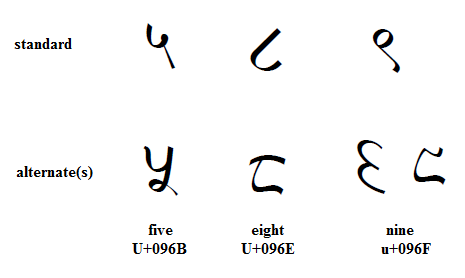

import CaptionText from '/src/components/CaptionText.astro';

The image below contrasts the standard Devanagari digits 5, 8 and 9 with alternate forms. The alternates are often used in Nepal and are considered more traditional, while the standard glyphs are more modern.

<CaptionText text='This article formerly appeared on ScriptSource.'/>