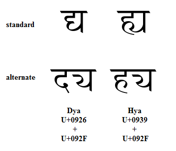

import CaptionText from '/src/components/CaptionText.astro';

The images below compare alternate forms of dya and hya. The standard rendering uses conjuncts; the alternate rendering uses an alternate form of the ya.

<CaptionText text='This article formerly appeared on ScriptSource.'/>