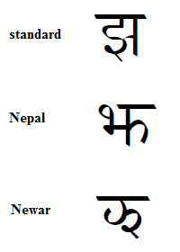

import CaptionText from '/src/components/CaptionText.astro';

The image below shows several forms of the Devanagari consonant jha. The form labeled "Nepal" is used mostly in that country, although they also use the "standard" form. The standard form is preferred in India. The form labeled "Newar" is used within the Newari language communities and rarely elsewhere.

<CaptionText text='This article formerly appeared on ScriptSource.'/>