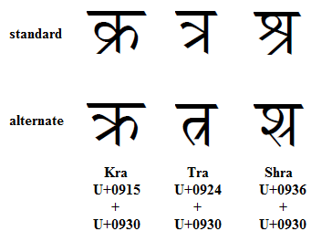

import CaptionText from '/src/components/CaptionText.astro';

The image below compares the standard and alternate forms of several conjuncts that include the consonant ra. The alternate forms are considered stylistic variations, although the alternates for tra and shra are quite rare.

<CaptionText text='This article formerly appeared on ScriptSource.'/>