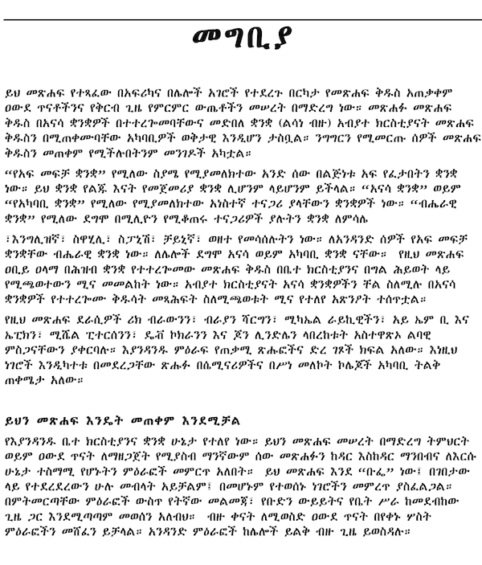

import CaptionText from '/src/components/CaptionText.astro';
import Attribution from '/src/components/Attribution.astro';

This is a modern text from a Scripture Use manual written in the Amharic language, using the Ethiopic script. This manual was published in 2008.

<Attribution type='Image' copyyears='2011' copyholder='SIL International' author='' license='CC BY-SA 3.0' licenseurl='https://creativecommons.org/licenses/by-sa/3.0/' source='' sourceurl=''/>

<CaptionText text='This article formerly appeared on ScriptSource.'/>