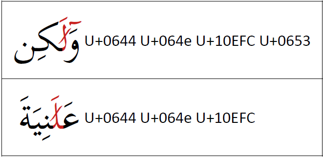

The :usv[10EFC]{usv char name} is a special form of a _superscript alef_. It has a separate codepoint since its appearance and behavior are different than that of :usv[0670]{usv char name}. The _alef overlay_ is only used with a _lam_ in certain orthographies. The same orthography can use the regular shape for _superscript alef_ in appropriate contexts. 

When a diacritic follows the _alef-overlay_ it is positioned in relation to the top right of the _alef-overlay_ rather than to the _lam_.

The image below demonstrates how _alef overlay_ is used word initially and word medially. The first example shows the position of :usv[0653]{usv char name} when it follows the _alef overlay_. 

