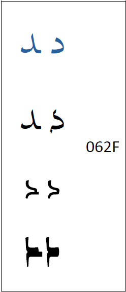

In Senegal, and in a few other regions of Africa, the design of :usv[062F]{usv char name}, and any character based on :usv[062F]{usv}, should have a different design than the standard Arabic _dal_.

The image below demonstrates how the _dal_ appears in a standard naskh typeface (in blue), and the glyphs below that are alternates found in [Scheherazade New][sch], [Harmattan][harm], and [Alkalami][alk]. The Scheherazade New and Harmattan alternates were designed specifically for Senegal. The _dal_ found in Alkalami is the design always used for the Rubutun Kano style of writing.

[sch]: https://software.sil.org/scheherazade
[harm]: https://software.sil.org/harmattan
[alk]: https://software.sil.org/alkalami

