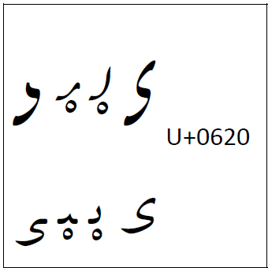
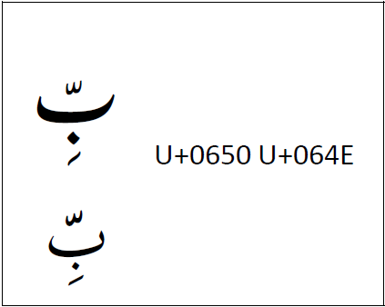
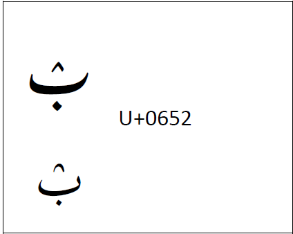
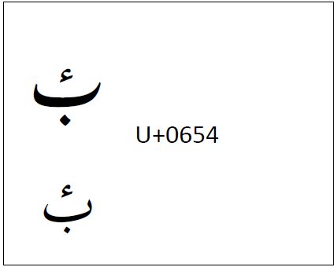
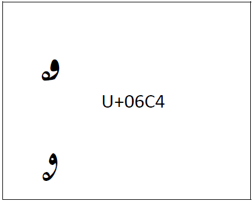
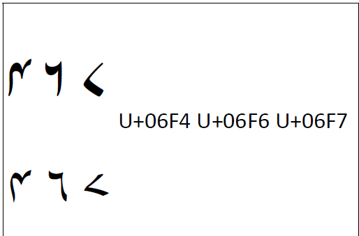

Kashmiri is generally written in the Nastaliq style of Arabic script. In general, Kashmiri follows the design of characters from Urdu. These are several descriptions of how some Kashmiri characters display. In the examples below, the Nastaliq style is used in the first line and Naskh is in the second line.

:usv[0620]{usv char name} was added specifically for the Kashmiri language, and its appearance in all four isolate, initial, medial, and final forms is somewhat different in that the circle only appears on the initial and medial forms. The isolate and finals have a short _tail_ with no circle. The example below demonstrates the _kashmiri yeh_ .

When used in conjunction with _shadda_, :usv[0650]{usv char name} often forms a ligature with the _kasra_ just below the _shadda_. Kashmiri does not follow this. The _kasra_ appears below the base rather than forming a ligature with _shadda_.

In Kashmiri, the :usv[0652]{usv char name} is an open _sukun_ with the opening facing down.

In Kashmiri, the :usv[0654]{usv char name} does not follow the Urdu design. It looks like the more standard Arabic-style hamza.

:usv[06C4]{usv char name} was specifically added for Kashmiri. However, the design in the Unicode charts has long been wrong. It has been corrected since Unicode 17.0 to the shape below. The _tail_ should not extend beyond the circle. 

Kashmiri digits follow the precedent set by Urdu. :usv[06F4]{usv char name}, :usv[06F6]{usv char name}, and :usv[06F7]{usv char name} have a different shape than in the Unicode charts.

See also [Kashmiri orthography notes][ri-kashmiri].

[ri-kashmiri]: https://r12a.github.io/scripts/arab/ks.html
