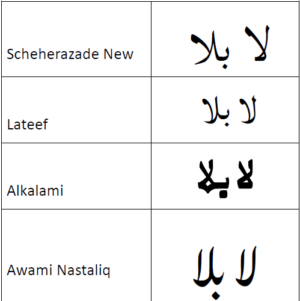
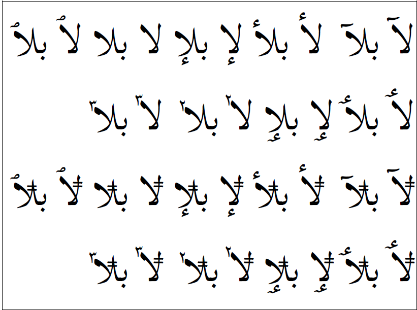
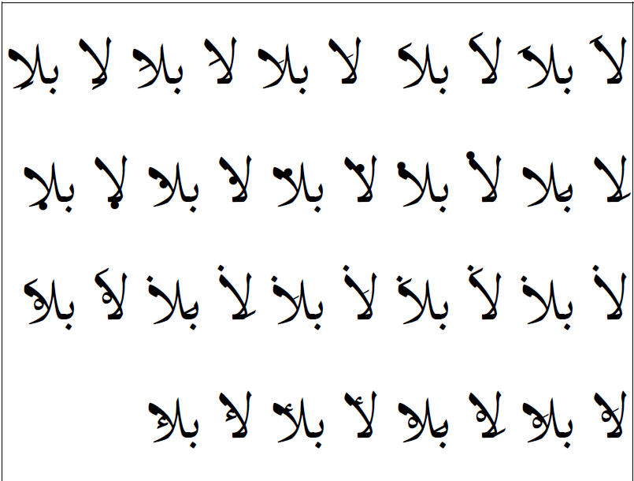

The _lam-alef_ ligature is considered an obligatory ligature in most styles of Arabic writing. In the common _hafs_ style of writing, the _lam_ is the right part of the ligature, and the _alef_ is the left side. There are eight _lam_ characters and 30 _alef_ characters encoded in Unicode. The potential for forming ligatures is quite large. Whatever that number is, it must be doubled, since _lam-alef_ can be either in isolate or final position.

There are a few different styles for how a _lam-alef_ ligature appears. The image below show some of the styles used in SIL fonts.

In most of the SIL Arabic fonts, the only _lam-alef_ ligatures implemented are all of the _lam_ characters (U+0644, U+06B5..U+06B8, U+076A, U+08A6, U+08C7) in conjunction with U+0622..U+0625, U+0627, U+0671..U+0673, and U+0773..U+0774. Ligatures were **not** implemented for U+0675 or U+0870..U+0882. The ones which are not included are not recommended for use (U+0675) or are not attested in actual practice (U+0870..U+0882).

The graphic below demonstrates _lam-alef_ ligatures with :usv[0644]{usv char name} and with all of the standard _alef_ characters that are supported. It also shows :usv[08A6]{usv char name} with the same _alef_ characters. U+08A6 is shown because the position of the bars must be slightly altered in the ligature.

In Scheherazade New, _lam-alef_ ligatures were also implemented with :usv[0644]{usv char name} and with (U+0870..U+0882). Without examples, it was difficult to decide where to put some of the attached marks. Nevertheless, the image below demonstrates how these Quranic _alef_ characters were implemented.

See [Lam-Alef and Kashida][lam-alef] for implementation strategies.

[lam-alef]: https://github.com/silnrsi/font-arab-tools/blob/master/documentation/developer/lamalef.md