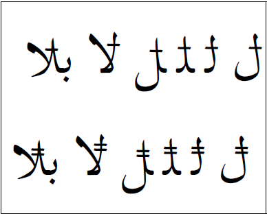

In SIL Arabic fonts, the design of :usv[076A]{usv char name} and :usv[08A6]{usv char name} originally had the bar at an angle. The feedback we received was that the bar should be horizontal. If left at an angle it was not recognized by the user community. Some of them thought it was a misplaced _fatha_. In addition, now that :usv[10EFC]{usv char name} has been encoded there is more room for confusion (see [Combining Alef Overlay](/articlelib/a/arab-combining-alef-overlay)).

The image below demonstrates how the two characters should appear in isolate, initial, medial, and final forms, as well as how they look in a _lam-alef_ ligature.

These characters do have the potential for increasing the possibilities of collisions with preceding characters.

