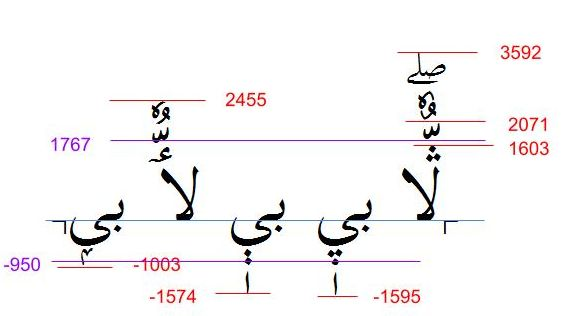

SIL Arabic fonts have been designed specifically for lesser known languages. Because those languages usually mark all the vowels, fonts may require a greater line spacing than fonts designed just for the Arabic language where vowels are not always marked.

Figuring out the character(s) requiring the highest ascent and lowest descent will be style-dependent. For example, in the [Scheherazade New][font-sch] font :usv[06B7]{usv char name} has the highest ascent, and the final form of :usv[0777]{usv char name} has one of the lowest descent values. Because vowels and other combining marks are also placed above or below characters, those must also be accounted for.

The image below demonstrates some of the calculations required in evaluating line spacing.

See also [Line Metrics](/topics/fonts/line-metrics/).

[font-sch]: https://software.sil.org/scheherazade/