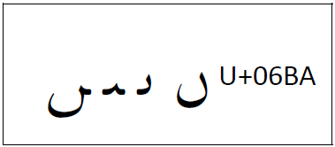

The :usv[06BA]{usv char name} should be dotless in all four positions of isolate, initial, medial, and final. Until this was clarified in the Unicode section on [Noon Ghunna][uni-noon-ghunna] many fonts had a dot on the initial and medial forms. Unfortunately, many users grew to expect that wrong behavior. The Unicode standard specifically says "The _noon ghunna_ has the shape of a dotless _noon_ and typically appears only in final and isolated contexts ... In the middle of words and morphemes, the normal _noon_, :usv[0646]{usv char name}, is used instead. To avoid ambiguity, sometimes a special mark, :usv[0658]{usv char name}, is added to the dotted _noon_ to indicate nasalization." 

[uni-noon-ghunna]: https://www.unicode.org/versions/latest/core-spec/#G47721
