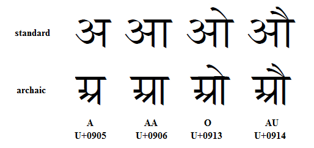

import CaptionText from '/src/components/CaptionText.astro';

The image below compares standard and archaic forms for several Devanagari vowels.

<CaptionText text='This article formerly appeared on ScriptSource.'/>