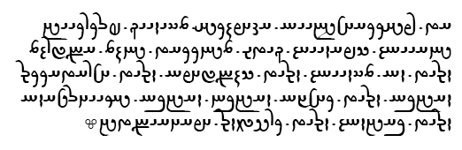

import CaptionText from '/src/components/CaptionText.astro';
import Attribution from '/src/components/Attribution.astro';

This is a sample of text taken from the Avesta scripture, Yasna 45.II. The text was produced using Ian James' Avestan font, available from the [Avestan script](https://skyknowledge.com/new-avestan.htm) page.

<Attribution type='Image' copyyears='2011' copyholder='SIL International' author='' license='CC BY-SA 3.0' licenseUrl='https://creativecommons.org/licenses/by-sa/3.0/' source='' sourceurl=''/>

<CaptionText text='This article formerly appeared on ScriptSource.'/>