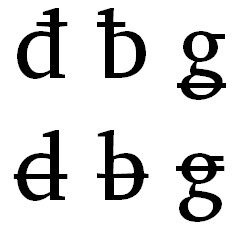

import CaptionText from '/src/components/CaptionText.astro';

Some languages (especially in the Americas) require the bar to be through the bowl of a character (or top bowl in the case of "g") rather than through the stem. The Unicode Consortium does not consider these characters eligible for encoding, they consider these to be glyph variants.

<CaptionText text='This article formerly appeared on ScriptSource.'/>