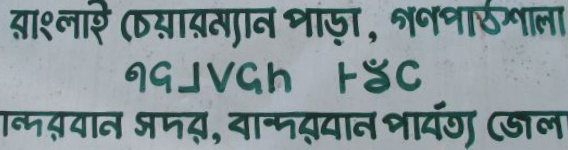

import CaptionText from '/src/components/CaptionText.astro';
import Attribution from '/src/components/Attribution.astro';

This is a photograph of a sign at the entrance to a village in the hills above Bandarban in East Bangladesh. Most of the sign is written in the Bengali script, but the middle line is in Mro. Image used with permission.

<Attribution type='Image' copyyears='2009' copyholder='Eddie Arthur' author='' license='CC BY-SA 3.0' licenseUrl='https://creativecommons.org/licenses/by-sa/3.0/' source='' sourceurl=''/>

<CaptionText text='This article formerly appeared on ScriptSource.'/>