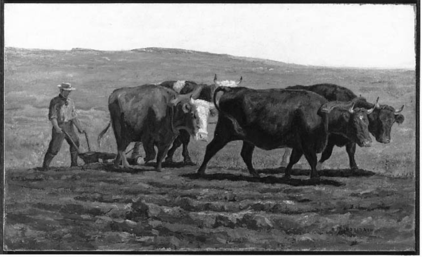
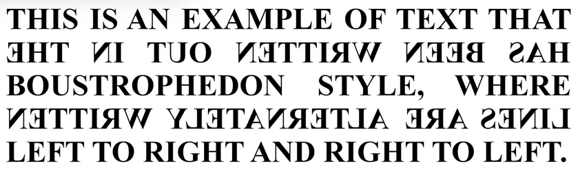
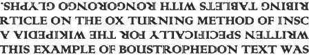

import CaptionText from '/src/components/CaptionText.astro';

Boustrophedon - a marvellous word - describes a kind of script behaviour in which one line is written from left-to-right, the next from right-to-left, and so on.  It's a Greek word derived from the words _Bous_, meaning 'ox', and _Strophe_, meaning 'turn', and refers to the movement of oxen when ploughing a field, turning at the end of each row. The characters are reversed on right-to-left lines so that they continue to face the direction of writing.  

<CaptionText text='Reference: Oxen Plowing. [Artist Thomas R. Robinson (public domain)](https://commons.wikimedia.org/wiki/File:Thomas_R._Robinson_-_Oxen_Plowing_-_88.343_-_Museum_of_Fine_Arts.jpg) on wikimedia'/>

Boustrophedon was particularly popular with stone engravers in Ancient Greece, but the [Ogham script](/scrlang/scripts/ogam), used in the British Isles from the 5th to the 10th century AD, was also commonly written that way.  Mechanically it makes sense: when the writing hand gets to the end of one line, it need not move back to start the next line but continues immediately below where it is.  Similarly, the reading eye does not need to travel as far as it does to read conventional script.  However, since the words and letters run forwards then backwards, the brain has to work rather harder to interpret the writing.

See how you get on:

<CaptionText text='Reference: English: An example of boustrophedon text. [Photo Lord Belbury&#x2019;s photo](https://commons.wikimedia.org/wiki/File:Boustrophedon_text.png) on wikimedia'/>

The [Rongorongo script](/scrlang/scripts/roro), discovered on Easter Island, uses reverse boustrophedon style in which alternate lines are upside down.  This also results in the 'ox plough' zig-zag line of text.  Reverse boustrophedon was customarily written from bottom to top like this:

<CaptionText text='Reference: Schematic of reverse boustrophedon text, in the fashion of rongorongo, but using the Latin alphabet. [Photo Kwamikagami&#x2019;s photo](https://commons.wikimedia.org/wiki/File:Reverse_boustrophedon.png) on wikimedia'/>

As far as we know, no scripts are written in boustrophedon style these days: do let us know if you come across any!

<CaptionText text='This article formerly appeared on ScriptSource.'/>