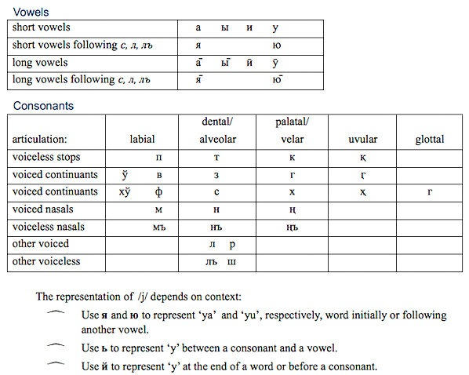

import CaptionText from '/src/components/CaptionText.astro';
import Attribution from '/src/components/Attribution.astro';

<CaptionText text='Based on David C. Shinen, _Siberian Yupik Literacy Manual_, SIL, 1967, pp. 3 and 15.'/>

The character repertoire for Central Siberian Yupik written with the Cyrillic script is as follows:

а в г з и й к л м н п р с т у ф х ш ъ ы ь ю я ў қ ң ҳ ӷ

This chart shows which Cyrillic characters are used to represent which phonemes in the Central Siberian Yupik language. In some older texts, the consonants қ, ң, ҳ and ӷ are written as к’, н’, х’ and г’, respectively.

<Attribution type='Image' copyyears='2011' copyholder='SIL International' author='Jim Brase' license='CC BY-SA 3.0' licenseurl='https://creativecommons.org/licenses/by-sa/3.0/' source='' sourceurl=''/>

<CaptionText text='This article formerly appeared on ScriptSource.'/>