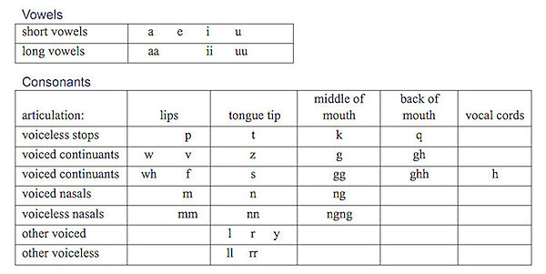

import CaptionText from '/src/components/CaptionText.astro';
import Attribution from '/src/components/Attribution.astro';

<CaptionText text='Based on David C. Shinen, _Siberian Yupik Literacy Manual_, SIL, 1967, pp. 3 and 15.'/>

The character repertoire for Central Siberian Yupik written with the Latin script is as follows: 

Aa Ee Ff Gg Hh Ii Kk Ll Mm Nn Pp Qq Rr Ss Tt Uu Vv Ww Yy Zz 

Other Latin characters may be used to write loan words.

This chart shows which letters are used to represent which sounds. Labialized velar consonants are indicated by writing a ‘w’ after them. An apostrophe can be used to disambiguate certain consonant clusters and to indicate the unusual labialization of non-velar consonants.

<Attribution type='Image' copyyears='2011' copyholder='SIL International' author='Jim Brase' license='CC BY-SA 3.0' licenseurl='https://creativecommons.org/licenses/by-sa/3.0/' source='' sourceurl=''/>

<CaptionText text='This article formerly appeared on ScriptSource.'/>