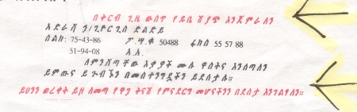

import CaptionText from '/src/components/CaptionText.astro';

Colored text has been used for centuries in the writings of the Ethiopian Orthodox Church, and even today it is frequently used as a substitute for bold text, or simply to bring attention to a headline.

<CaptionText text='This article formerly appeared on ScriptSource.'/>