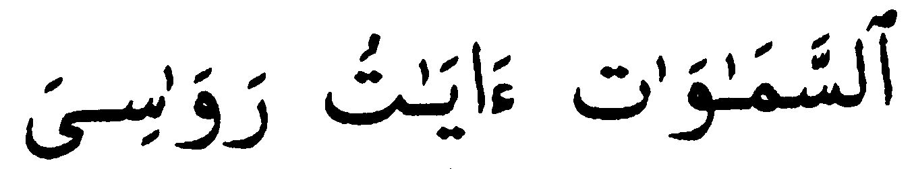
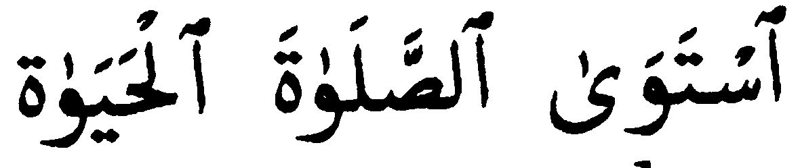
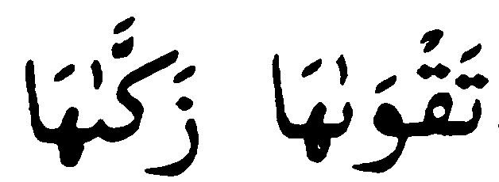

import Character from '/src/components/Character.astro';

In order to implement correct behavior in fonts for the _dagger-alef_ (<Character usv="0670" options="usv,char,name"/>) one needs to understand how it should appear. Although there are exceptions, the _dagger-alef_ is not generally written in modern texts, it is primarily used in classical texts.

Regarding the _dagger-alef_, Fahmy ([Fahmy, Hossam A. H. 2006, Vol 27, No 2. AlQalam for typesetting traditional Arabic texts. TUGBoat. p. 164][src-fahmy]) says: 

>"It is considered a separate character that appears on its own in cases such as

>On the other hand, it is considered a mark on top of the underlying character in cases such as

>If the dagger alif is a mark, its positioning on the character is similar to that of the short vowels."

In the case of _dagger-alef_ as a "separate character", _dagger-alef_ should be placed above a space or even above <Character usv="00A0" options="usv,char,name"/>(Unfortunately, Microsoft Word does not support the _dagger-alef_ on a space. However, LibreOffice does support it.) When developing a font, <Character usv="0020" options="usv,char,name"/> and <Character usv="00A0" options="usv,char,name"/> must support putting a combining mark (such as <Character usv="0067" options="usv,char,name"/>) above the space.}. See _dagger-alef_ **above the space** in the first word of the first sample above.

In general, if _dagger-alef_ is above a "tooth" then the anchor point for the _dagger-alef_ should be centered above the tooth (there are some who disagree with this and believe the _dagger-alef_ should be slightly to the left of the "tooth"). The example below shows the _dagger-alef_ above the tooth of both the initial and medial yeh:

If a consonant has a vowel above it (such as the _fatha_) followed by a _dagger-alef_, then a _kashida_ (<Character usv="0640" options="usv,char,name"/>) can be inserted before the _dagger-alef_. This places the _dagger-alef_ after the consonant (rather than above the _fatha_) but before the next consonant. See _dagger-alef_ between the _meem_ and the _waw_ below:

Some fonts will offset the dagger alif a little to the left if the character already has a _fatha_ or another vowel above it. 

[src-fahmy]: http://www.tug.org/tugboat/tb27-2/tb87fahmy.pdf
