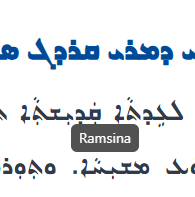
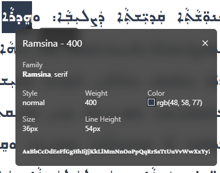
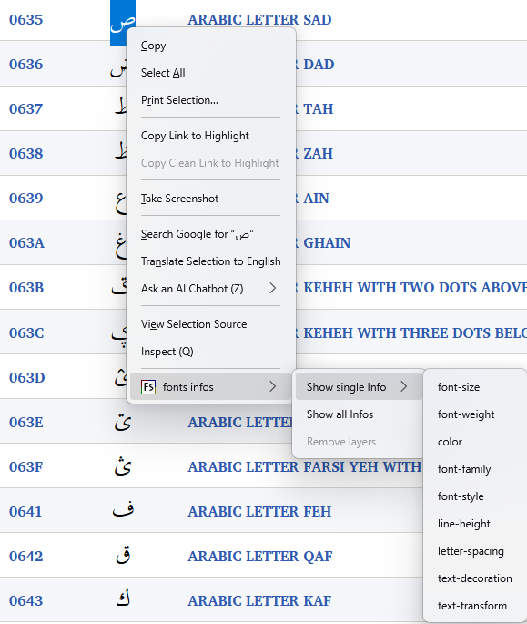
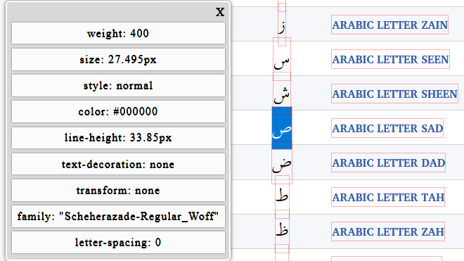

It is often really important to be able to determine exactly which font the browser is using to display a bit of text. Unfortunately it's not always straightforward to figure this out, since the browser doesn't necessarily use the exact font that is specified in the HTML or CSS. There are several situations where the browser may substitute one font for another:

- the preferred font can't be located or there is an error in loading it
- the preferred font doesn't support the characters to be displayed

For this reason, it is standard practice for a font style to specify a list of fonts, rather than a single one, to ensure that the browser can find some reasonable option if the preferred font is not available. Often the final option in the list will be a general descriptor like "sans-serif" to give the best chance possible of finding a usable font. For instance, to display some Arabic text, you might use a font style with the following list of fonts:

```
arabicText { font-family: "Scheherazade-R.ttf", "arabtype.ttf", sans-serif; }
```

Of course, "sans-serif" is not a terribly meaningful descriptor for an Arabic font, but it provides a better-than-nothing suggestion about how to find an acceptable font if neither Scheherazade New nor Arabic Typesetting is available.

So suppose you have an Arabic character displayed in your browser, and you want to find exactly which font is being used. Well, the options are different for different browsers, and some are better than others.

## Chrome

Chrome has a handy utility to tell you what font is used for a range of text, an extension called [WhatFont][chrome-whatfont]. The nice thing about this utility is that once you activate it, you can simply hover over a bit of text and it will show you what font it is using.



The disadvantage of this utility is that it is clueless in situation 2 above - where the specified font exists but does not support the characters in the text.

If you click, instead of hovering, more detailed information will appear. 



This will indicate when the preferred font is not available and the second choice was used. But it does not indicate _which_ font it found to match a generic descriptor like "sans-serif."

## Firefox

Firefox also has a [WhatFont][firefox-whatfont] extension that works in the same way as it does in Chrome.

In addition, Firefox has an add-on called [font infos][firefox-font-infos]. When this is installed in your Firefox browser, you can select a range of text, right-click, choose "font infos", and you will see a little dialog indicating _exactly_ which fonts were used. You can also "pin" the add-on to the Firefox toolbar. Although the tool is not terribly convenient to use if you have a lot of text to check, it has the advantage of handling both of the substitution situations above.



Once the extension is selected, the font information will be shown:



Even if the browser falls back to a font that is not included in the style's font list, the **FontInfo** tool will indicate exactly which one is being used.

## Edge

Edge also has a [WhatFont][edge-whatfont] extension that works in the same way as it does in Chrome.

In Edge you can also try opening the Developer Tool pane (press F12), finding the HTML for the text of interest, and seeing what font style was applied. You can fairly easily locate the relevant HTML by pressing Ctrl-Shift-B or clicking the "Select element" tool and then clicking on the text.

In theory, the Console pane should list which fonts could not be loaded among its errors, but I have found this to be unreliable, especially for truly non-existent fonts.

## Summary

Different browsers may use different algorithms for performing font substitution, so to truly test web font behavior, you may need to test it on different browsers. Unfortunately, the WhatFont tool, although handy to use, is not fully up to the job, and Edge is quite inadequate.


[firefox-font-infos]: https://addons.mozilla.org/en-US/firefox/addon/font-infos/
[firefox-whatfont]: https://addons.mozilla.org/en-US/firefox/addon/zjm-whatfont/
[chrome-whatfont]: https://chrome.google.com/webstore/detail/whatfont/jabopobgcpjmedljpbcaablpmlmfcogm?hl=en
[edge-whatfont]: https://microsoftedge.microsoft.com/addons/detail/what-font-%E2%80%93-font-finder-/gdcikldkablicfibcmjfbodphcegnnep
