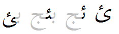

import Character from '/src/components/Character.astro';

As part of the development process for the Nastaliq-style font I'm working on, I've needed to come to grips with the different forms of "hamza" characters and how they are rendered.

<Character usv="0621" options="usv,char,name"/>

This is the standard hamza base character, essentially the head of an ain (<Character usv="0639" options="char"/>). It is always displayed as an isolate form, causing breaking in the middle of the word. It never has cursive connections to other characters.

<Character usv="0626" options="usv,char,name"/>

This character can be called a "hamza-yeh". Although it appears to combine in interesting ways with other characters, it is not a combining character in the typical sense.

In the initial and medial forms, it takes the form of a beh (<Character usv="0628" options="char"/>) with a hamza above and no nuqta. In final or isolate form, it takes the form of a yeh (<Character usv="0649" options="char"/>) with a hamza above.

<Character usv="0654" options="usv,char,name"/>, <Character usv="0655" options="usv,char,name"/>, <Character usv="065F" options="usv,char,name"/>

These characters are true combining characters; they behave like diacritics. It is unlikely to find them on letters that also contain nuqtas, so for rendering purposes they could take the place of nuqtas. You would generally expect to find them on vowels or approximants such as alif, waw, yeh, yeh-barree (bariyeh), heh, goal-heh, reh, or laam.

The wavy hamza looks like this: <Character usv="065F" options="char"/> . It is used in lesser-known languages written with Arabic script.

<Character usv="0674" options="usv,char,name"/>

This character is intended only for use in a few languages like Kazakh and perhaps Uyghur. It is considered a base character, but is written in conjunction with other characters in a unique way.

Since I am working with Nastaliq, I don't need to support it, so I haven't bothered to research it much. :-) If you can describe its behavior or usage, please comment below!

**Characters that include a hamza**

Some other characters that include a hamza are:

- <Character usv="0623" options="usv,char,name"/>
- <Character usv="0624" options="usv,char,name"/>
- <Character usv="0625" options="usv,char,name"/>
- <Character usv="0672" options="usv,char,name"/>
- <Character usv="0673" options="usv,char,name"/>
- <Character usv="0675" options="usv,char,name"/>
- <Character usv="0676" options="usv,char,name"/>
- <Character usv="0677" options="usv,char,name"/>
- <Character usv="0678" options="usv,char,name"/>
- <Character usv="0681" options="usv,char,name"/>
- <Character usv="06C2" options="usv,char,name"/>
- <Character usv="06D3" options="usv,char,name"/>
- <Character usv="076C" options="usv,char,name"/>
- <Character usv="08A8" options="usv,char,name"/>

