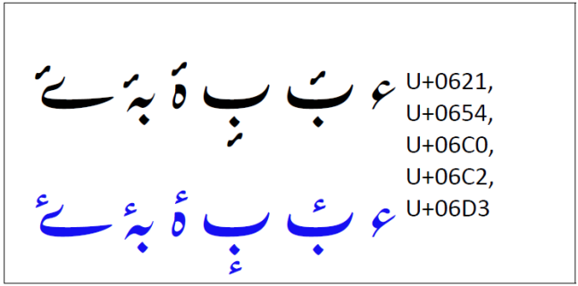
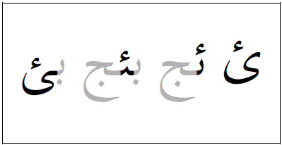
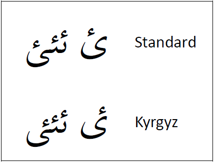
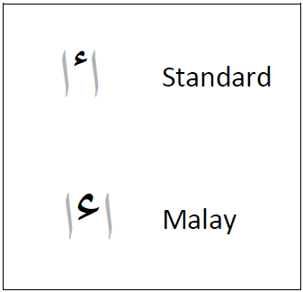

import Character from '/src/components/Character.astro';

As part of the development process for the Nastaliq-style font I'm working on, I've needed to come to grips with the different forms of "hamza" characters and how they are rendered.

### <Character usv="0621" options="usv,char,name"/>

This is the standard hamza base character, essentially the head of an ain (<Character usv="0639" options="char"/>). It is always displayed as an isolate form, causing breaking in the middle of the word. It never has cursive connections to other characters.

In general, the Nastaliq-style of the _hamza_ is written in a similar manner to the Naskh-style of _hamza_. However, when used as a combining mark on a base character, it usually looks more like a wavy character. Some languages, such as Kashmiri, will retain the _hamza_ shape as used in the blue line below.

### <Character usv="0626" options="usv,char,name"/>

This character can be called a "hamza-yeh". Although it appears to combine in interesting ways with other characters, it is not a combining character in the typical sense.

<Character usv="0626" options="usv,char,name"/> is canonically equivalent to the sequence &lt;<Character usv="064A" options="usv,char,name"/>, <Character usv="0654" options="usv,char,name"/>&gt;. However, when _hamza above_ is applied to _yeh_, it loses its dots in all positional forms. See the [Combining Hamza][uni-hamza] section in The Unicode Standard.

In addition, the position of the _hamza above_ is different for the Kyrgyz language. The _hamza_ should be placed toward the top of the _yeh_ in isolate and final forms, rather than over the bowl.

### <Character usv="0654" options="usv,char,name"/>, <Character usv="0655" options="usv,char,name"/>, <Character usv="065F" options="usv,char,name"/>

These characters are true combining characters; they behave like diacritics. It is unlikely to find them on letters that also contain nuqtas, so for rendering purposes they could take the place of nuqtas. You would generally expect to find them on vowels or approximants such as alif, waw, yeh, yeh-barree (bariyeh), heh, goal-heh, reh, or laam.

The wavy hamza looks like this: <Character usv="065F" options="char"/> . It is used in lesser-known languages written with Arabic script.

### <Character usv="0674" options="usv,char,name"/>

This character is intended only for use in a few languages like Kazakh, Malay, and perhaps Uyghur. It is a base character (spacing), not a combining mark. 

The following characters are not recommended for use. Their compatibility decompositions include <Character usv="0674" options="usv,char,name"/>, but the ordering of characters in the decomposition sequences are the reverse of what is expected. 

- <Character usv="0675" options="usv,char,name"/>
- <Character usv="0676" options="usv,char,name"/>
- <Character usv="0677" options="usv,char,name"/>
- <Character usv="0678" options="usv,char,name"/> 

Additionally, Malay Jawi uses <Character usv="0674" options="usv,char,name"/>. The position of the _high hamza_ remains at three-quarters height, but it is similar in size to <Character usv="0621" options="usv,char,name"/>. 

See the [High Hamza][uni-high-hamza] section in The Unicode Standard.

### Characters that include a hamza

Some other characters that include a hamza are:

- <Character usv="0623" options="usv,char,name"/>
- <Character usv="0624" options="usv,char,name"/>
- <Character usv="0625" options="usv,char,name"/>
- <Character usv="0672" options="usv,char,name"/>
- <Character usv="0673" options="usv,char,name"/>
- <Character usv="0675" options="usv,char,name"/>
- <Character usv="0676" options="usv,char,name"/>
- <Character usv="0677" options="usv,char,name"/>
- <Character usv="0678" options="usv,char,name"/>
- <Character usv="0681" options="usv,char,name"/>
- <Character usv="06C0" options="usv,char,name"/>
- <Character usv="06C2" options="usv,char,name"/>
- <Character usv="06D3" options="usv,char,name"/>
- <Character usv="076C" options="usv,char,name"/>
- <Character usv="0881" options="usv,char,name"/>
- <Character usv="0882" options="usv,char,name"/>
- <Character usv="08A8" options="usv,char,name"/>

[uni-high-hamza]: https://www.unicode.org/versions/latest/core-spec/chapter-9/#G66979
[uni-hamza]: https://www.unicode.org/versions/latest/core-spec/chapter-9/#G58105