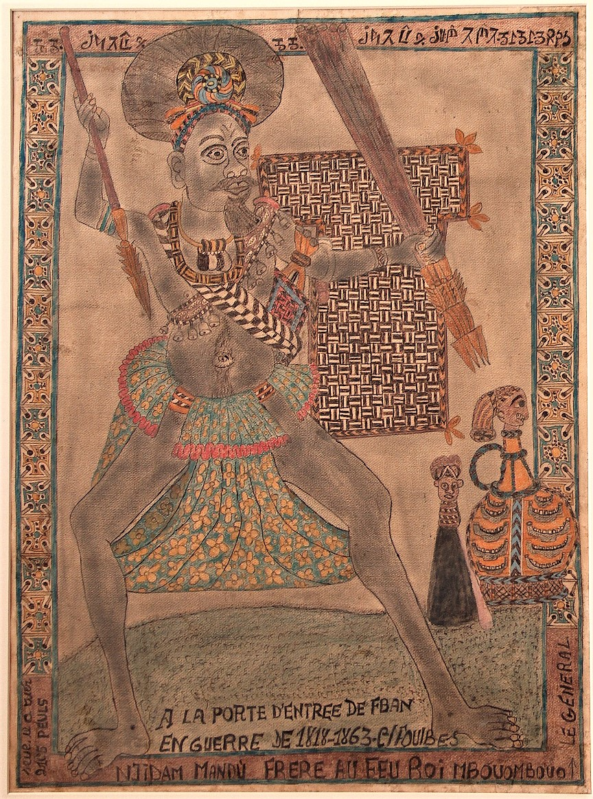

import CaptionText from '/src/components/CaptionText.astro';
import Attribution from '/src/components/Attribution.astro';

Drawing c. 1930, thought to be by Johannes Yerima, also known as Ibrahim Njoya, of a war hero, General Njidam Mandù of Cameroon, brother of the deceased King Mbouombouo.

The drawing has a French inscription at the bottom, and a Bamun inscription, in the Bamum script, at the top.

<Attribution type='Image' copyyears='' copyholder='' author='' license='Public Domain' licenseUrl='' source='' sourceurl=''/>

<CaptionText text='This article formerly appeared on ScriptSource.'/>