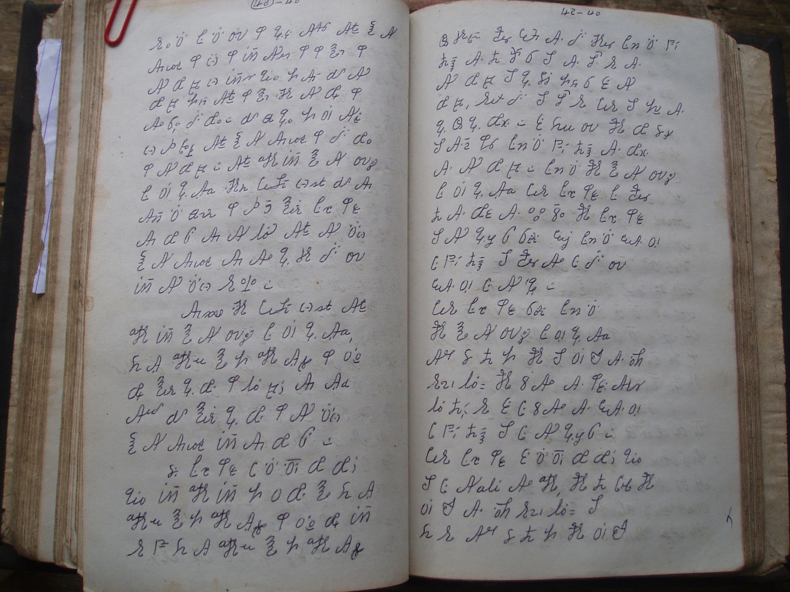

import CaptionText from '/src/components/CaptionText.astro';
import Attribution from '/src/components/Attribution.astro';

<CaptionText text='Piers Kelly, A description of the Eskayan alphasyllabary of the Philippines: the form, function and origins of a post-colonial writing system.'/>

Pages from the Eskaya literary corpus. The left-hand page is in the Cebuano language and the right-hand page is in the Eskayan language, both written with the Eskaya script.

<Attribution type='Image' copyyears='2014' copyholder='Piers Kelly' author='' license='CC BY-SA 3.0' licenseUrl='https://creativecommons.org/licenses/by-sa/3.0/' source='' sourceurl=''/>

<CaptionText text='This article formerly appeared on ScriptSource.'/>