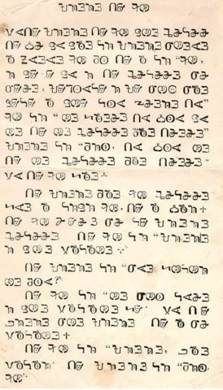

import CaptionText from '/src/components/CaptionText.astro';
import Attribution from '/src/components/Attribution.astro';

<CaptionText text='Correspondence with Mr Varnie N'jola Karmo'/>

A page from a document printed using Dr. Narvin Lewis' printing press, produced in the early 1900s. Courtesy of Varnie N'jola Karmo

<Attribution type='Image' copyyears='' copyholder='' author='' license='Public Domain' licenseUrl='' source='' sourceurl=''/>

<CaptionText text='This article formerly appeared on ScriptSource.'/>