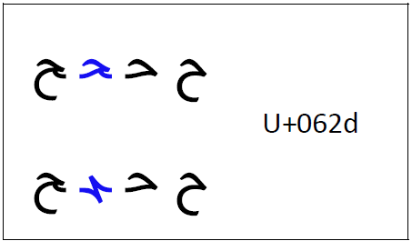

import CaptionText from '/src/components/CaptionText.astro';
import Character from '/src/components/Character.astro';

Medial form of <Character usv="062d" options="usv,char,name"/>, and characters based on that shape, can have a more handwritten style of writing in the African context.

