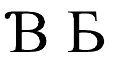

import CaptionText from '/src/components/CaptionText.astro';

U+0181 is used by many languages. The glyph the Unicode Consortium and most languages use is on the left and the glyph used by a few Liberian orthographies is on the right:

<CaptionText text='This article formerly appeared on ScriptSource.'/>