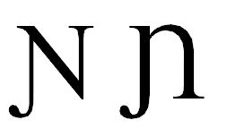

import CaptionText from '/src/components/CaptionText.astro';

U+019D is used by many languages. The glyph the Unicode Consortium uses is on the left and the glyph used by many African orthographies is on the right:

<CaptionText text='This article formerly appeared on ScriptSource.'/>