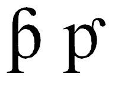

import CaptionText from '/src/components/CaptionText.astro';

U+01A5 is used by the Serer language in Senegal. The glyph the Unicode Consortium uses is on the left and the glyph used in the Serer orthography is on the right:

<CaptionText text='This article formerly appeared on ScriptSource.'/>