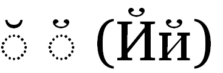

import CaptionText from '/src/components/CaptionText.astro';

The standard glyph for :usv[0306]{usv char name}, as used in Latin, is shown on the left. However, in Cyrillic, this character has a different appearance, as can be seen in the second glyph, and the characters in parentheses which also use the breve.

<CaptionText text='This article formerly appeared on ScriptSource.'/>