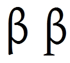

import CaptionText from '/src/components/CaptionText.astro';

The glyph on the left is similar to the glyph the Unicode Consortium uses in the Unicode code charts. It is the style used in Greek fonts. The glyph on the right is the style generally preferred for IPA usage. The significant difference is in the serif on the bottom of the stem.

<CaptionText text='This article formerly appeared on ScriptSource.'/>