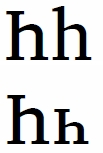

import CaptionText from '/src/components/CaptionText.astro';

There is a glyph variant for this character which is used in Mongolian.

In the first row you see the uppercase (U+04BA) followed by U+04BB (which looks much like a Latin "h"). In the second row the uppercase is the same, however, U+04BB looks more like a smaller version of the uppercase.

<CaptionText text='This article formerly appeared on ScriptSource.'/>