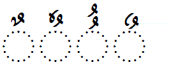

import CaptionText from '/src/components/CaptionText.astro';

In standard Arabic, and for most languages using the Arabic script, the glyph for :usv[064C]{usv char name} is what is seen on the left below. However, there are at least three other variants as can be seen in the examples below.

<CaptionText text='This article formerly appeared on ScriptSource.'/>