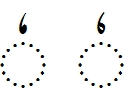

import CaptionText from '/src/components/CaptionText.astro';

The traditional shape for :usv[0657]{usv char name} is on the left. The "open" style is used by some languages in West Africa.

<CaptionText text='This article formerly appeared on ScriptSource.'/>