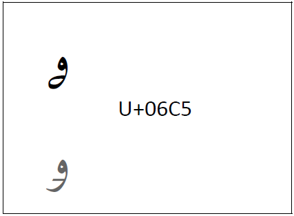

import CaptionText from '/src/components/CaptionText.astro';
import Character from '/src/components/Character.astro';

Up until version 14.0 of The Unicode Standard, the glyph in the codecharts for <Character usv="06C5" options="usv,char,name"/> was not the preferred glyph by the Kyrgyz language community. The glyph was adjusted in Unicode 14.0 to reflect the preferred design (top glyph) for _kirghiz oe_. 

[uni-errata-14]: https://www.unicode.org/versions/Unicode14.0.0/erratafixed.html
