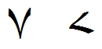

import CaptionText from '/src/components/CaptionText.astro';

In standard Arabic, and for most languages using the Arabic script, the glyph for :usv[06F7]{usv char name} is what is seen on the left below. However, Urdu, Sindhi and Rohingya use a different glyph as demonstrated on the right below.

<CaptionText text='This article formerly appeared on ScriptSource.'/>