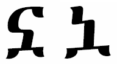

import CaptionText from '/src/components/CaptionText.astro';
import BibEntry from '/src/components/BibEntry.astro';

The glyph on the left is the glyph the Unicode Consortium uses in the Unicode code charts. The glyph on the right is an old style version of the same character. The right glyph is used in Cohen and also is referenced in the [ALA-LC][ala-lc-ethi] charts.

### Bibliography

- <BibEntry key="cohen1970" />

<CaptionText text='This article formerly appeared on ScriptSource.'/>

[ala-lc-ethi]: http://www.loc.gov/catdir/cpso/romanization/amharic.pdf

