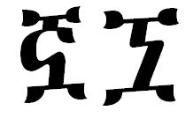

import CaptionText from '/src/components/CaptionText.astro';

The glyph on the left is the glyph the Unicode Consortium uses in the Unicode code charts. The glyph on the right is an old style version of the same character. They are used in [Cohen](https://scriptsource.org/source/te3bw27bzl).

<CaptionText text='This article formerly appeared on ScriptSource.'/>