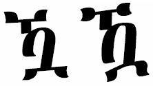

import CaptionText from '/src/components/CaptionText.astro';

The glyph on the left is the glyph the Unicode Consortium uses in the Unicode code charts. The glyph on the right is a variant of the same character. 

<CaptionText text='This article formerly appeared on ScriptSource.'/>