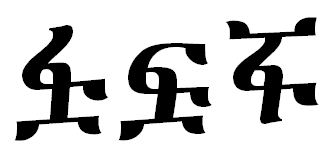

import CaptionText from '/src/components/CaptionText.astro';

The glyph on the left is the glyph the Unicode Consortium uses in the Unicode code charts. The two glyphs on the right are old style versions of the same character. They are used in [Cohen](https://scriptsource.org/source/te3bw27bzl) and are also referenced in the [ALA-LC](http://www.loc.gov/catdir/cpso/romanization/amharic.pdf) charts.

<CaptionText text='This article formerly appeared on ScriptSource.'/>